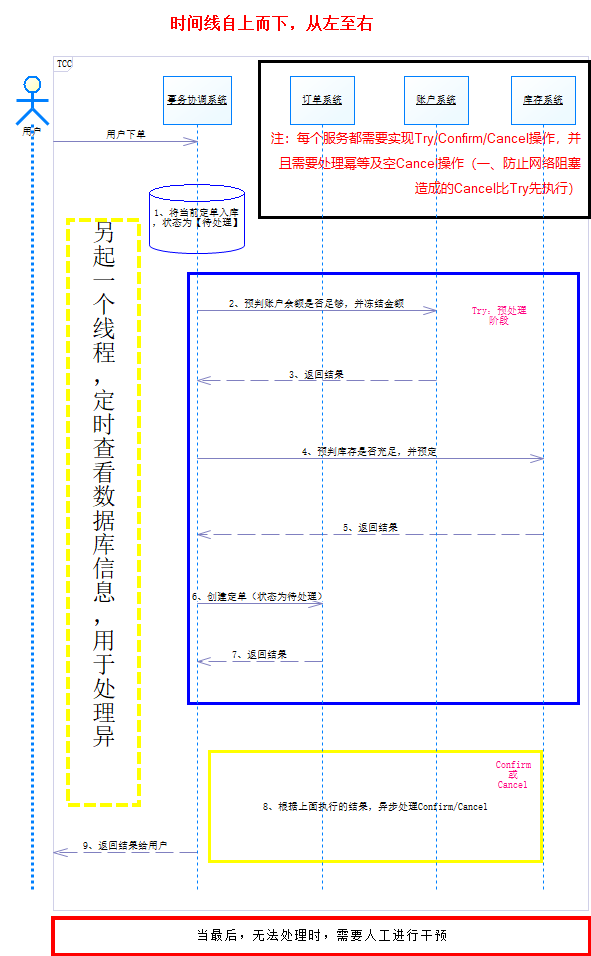

# 分布式事务实现方式----TCC 事务管理器
尝试写个TCC事务管理器，用来统一处理事务

## 事务原理
网上有很多关于TCC事务的原理，此处不再赘述，可以查看[分布式解决方案](https://servicecomb.apache.org/docs/distributed_saga_3/)，此处详细说下

用户下单之后，将需要事务处理的请求发送到事务协调系统（Coordinator），统一管理各个服务，

下面以下单为例的【正常】流程：
* 1、将用户下单的信息保存起来，状态为：待处理
* 2~7、预处理阶段（Try），并将处理成功的信息保存起来，以便后续【提交/回滚】使用。
* 8、根据预处理的结果，决定是提交还是回滚。
* 9、如果全部处理成功，则修改1中保存起来的数据的状态：处理成功；如果失败，则修改状态为：处理失败
* 10、结束处理，并返回

【异常】流程说明：
此异常处理，主要是处理【提交/回滚】时失败，另起一个线程，定时查看数据情况。
一旦发现有处理异常的数据，则再一次触发【提交/回滚】流程，如果达到重试上限（默认5次），最后仍处理失败，需要通知相关人员（发送邮件），进行人工干预

## 代码流程
* 1、启动时，加载初始化数据（每个请求，分别转发（try/confirm/cancel）地址），数据结构如下：
```
[
  {
    "url_pattern": "^accounts/order/(.)*",
    "nodes": [
      {
        "index": 0,
        "try": {"url":"http://localhost:8083/accounts/order/try/$1", "method":"POST", "timeout": 5},
        "confirm": {"url":"http://localhost:8083/accounts/order/confirm/$1", "method":"POST", "timeout": 5},
        "cancel": {"url":"http://localhost:8083/accounts/order/cancel/$1", "method":"POST", "timeout": 5},
      },
      {
        "index": 1,
        "try": {"url":"http://localhost:8084/stores/order/try/$1", "method":"POST", "timeout": 5},
        "confirm": {"url":"http://localhost:8084/stores/order/confirm/$1", "method":"POST", "timeout": 5},
        "cancel": {"url":"http://localhost:8084/stores/order/cancel/$1", "method":"POST", "timeout": 5},
      },
    ],
  }
]
```
* 2、接收到请求后，将`请求URL`重写为指定的一系列`Try`的`URL`，参数仍为请求时使用的参数
* 3、执行成功，则将成功的那条持久，为后续重试使用
* 4、根据`2`执行结果，分别执行`Confirm`或`Cancel`，根据结果，更新`3`持久的数据状态
* 5、根据`4`执行的结果，分别修改对应数据的状态
* 6、启动时，另起一个线程，用于定时监控数据状态，发现需要重试的数据，则执行`1~5`步骤
* 7、另起一个线程，用于发送无法处理的数据信息到指定邮箱